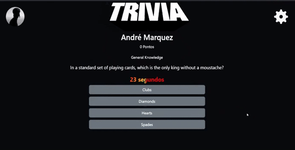

   

<h1 align="center">Jogo de Trivia</h1>
<p align="center">Jogo de Trivia é um jogo de perguntas e respostas</p>
<p align="center"> 
  
 </p>

# Sumário

• [Sobre o Projeto](#-sobre-o-projeto)

• [Tecnologias utilizadas no desenvolvimento do projeto](#-tecnologias-utilizadas-no-desenvolvimento-do-projeto)

- [Como executar o projeto](#-como-executar-o-projeto)
  - [Remotamente](#remotamente)
  - [Localmente](#localmente)
- [Contribuidores](#-contribuidores)

### 💻 Sobre o Projeto

<p>Um jogo de perguntas e respostas baseado no jogo Trivia (tipo um show do milhão americano rs) utilizando React e Redux, desenvolvido em grupo suas funcionalidades de acordo com as demandas definidas em um quadro Kanban.</p>
<p>Criado durante o curso da Trybe com um grupo de 5 alunos, o método Kanban foi aplicado com a ferramenta trello, <a target="_blank" href="src/assets/to_readme/kanbanTrivia.png">Imagem do Projeto no Trello</a> , as perguntas são trazidas da API de Trivia, com dois endpoints, uma para pegar o token de sessão da pessoa que está jogando e outro para pegar perguntas e respostas, a cada resposta certa é feito um calculo : dificuldade da pergunta * tempo de resposta + 10 = pontos. </p>

### 🛠 Tecnologias utilizadas no desenvolvimento do projeto

- **[React](https://github.com/facebook/react)**
- **[React Router Dom](https://github.com/ReactTraining/react-router/tree/master/packages/react-router-dom)**
- **[Redux](https://github.com/facebook/react)**
- **[Jest](https://github.com/facebook/jest#-delightful-javascript-testing)**
- **[Bootstrap](https://getbootstrap.com/)**
  > Veja o arquivo [package.json](https://github.com/andremarquezz/ProjetoTrivia/blob/Trivia/package.json)

# 🚀 Como executar o projeto

### Remotamente

_Copie a URL abaixo e cole no seu navegador_

```jsx
https://andremarquezz.github.io/ProjetoTrivia/#/
```

### Localmente

_Pré-requisitos_

Antes de começar, você vai precisar ter instalado em sua máquina as seguintes ferramentas:
[Git](https://git-scm.com), [Node.js](https://nodejs.org/en/).
Além disto é bom ter um editor para trabalhar com o código como [VSCode](https://code.visualstudio.com/)

_1- Clonar o repositorio_

```jsx
git@github.com:andremarquezz/ProjetoTrivia.git
```

_2- Executar o comando abaixo no terminal, dentro da pasta do projeto._

```jsx
npm install
```

_3- Executar o comando abaixo no terminal, dentro da pasta do projeto._

```jsx
npm start
```
*A aplicação contém testes, para executar basta digitar o comando abaixo no terminal, dentro da pasta do projeto.* 
```jsx 
npm test
```

# 👨‍💻 Contribuidores

💜 Um super obrigado para esse grupo que em união fizemos esse projeto sair do campo da ideia.

*Iasmin Gabrig
*Welyson Rosa
*Sarah Reis
*Paulo Medeiros
